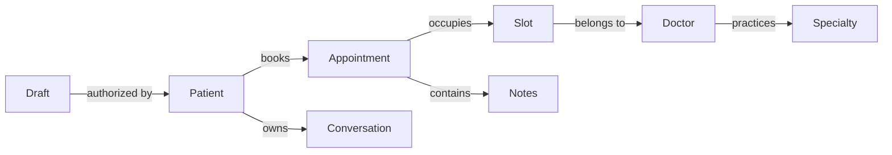

# Clinic Assistant semantic layer

Clinic Assistant's ontology is an application-owned domain model inspired by operational ontologies. It is not a Palantir integration or a general graph database. Version `1.0.0` lives in `src/lib/semantic` and is used at runtime, not only in prompts.

## Sources of truth

| Definition | Source | Runtime consumers |
| --- | --- | --- |
| Entities, relationships, provenance, temporal meanings and invariants | `src/lib/semantic/ontology.ts` | Current appointment descriptions, legacy scheduling, model instructions |
| Mutation meaning, roles, resource access, prerequisites, review labels and outcome codes | `src/lib/semantic/actions.ts` | Server policy, draft reviews, UI action activity, receipts, generated catalog |
| Input shape and normalization | `mutationVariants` and `mutation` in `src/lib/workspace.ts` | Request validation and generated JSON schema in the catalog |
| Executable role, ownership, appointment eligibility and slot checks | `src/lib/semantic/policy.ts` | Workspace prepare and confirm, legacy booking proposals and appointment mutations |
| Role-filtered model-readable catalog | `src/lib/semantic/catalog.ts` | Capabilities, website text and Realtime instructions, `get_ontology` tool |

No patient records, credentials, tokens or free-form notes belong in the ontology definition. `get_ontology` returns definitions, not permission to query arbitrary graph nodes. Record access still uses existing permission-scoped handlers and database row-level security.

## Execution

1. Mira interprets a request and selects a typed tool. Aliases are vocabulary hints, not an intent classifier or an authorization mechanism. Ambiguous targets require clarification.
2. The server normalizes and validates inputs with the existing Zod schemas.
3. The shared action policy checks the authenticated actor and fresh, server-fetched facts. Facts supplied by a model must never be trusted as policy evidence.
4. Prepare produces a reviewed, signed draft, with `draft_prepared` semantics. The draft reserves nothing.
5. Confirmation verifies identity, expiry and ontology version, rechecks current facts, and uses the existing single-attempt confirmation claim. Old-version workspace drafts must be prepared and reviewed again.
6. Database operations enforce final constraints and atomic updates. Availability checked during preparation can still change before execution.
7. Successful receipts carry an explicit version, entity and outcome code. Failed calls do not receive completion receipts; a timeout must never be interpreted as success or permission to retry a write blindly.

For example, `appointment_rescheduled` means the appointment moved. `reschedule_requested` means a doctor recorded a request while the existing slot remained reserved. `doctor_message_saved` means a note was appended, not that an email was sent or a doctor read it.

## Channels and compatibility

Website voice and text use the same role-filtered catalog and workspace action handler. Manual workspace controls use that handler too. The legacy chat/telephone engine receives the same entity relationships and invariants, while retaining its restricted tool set. Legacy appointment endpoints use the shared policy and outcome codes; their existing proposal/confirmation wire formats remain compatible.

The telephone bridge remains limited to public clinic help and availability. Publishing an action in the ontology does not make it available on every channel.

## Extending safely

1. Add or update the mutation schema. The exhaustive contract type and coverage test require a corresponding registry entry.
2. Define exact meaning, affected entity, actor roles, ownership scope, fact requirements and outcome. Avoid conflating requests with completed changes.
3. Implement the server handler and database enforcement. Registry entries alone cannot execute writes.
4. Add policy tests covering allowed and denied actors, missing/stale facts and relevant state transitions, plus flow tests for confirmation and actual outcomes.
5. Increment the ontology version when changing action meaning or policy. Existing workspace drafts will require renewed review.

Run `npm test`, `npm run typecheck`, and the relevant Playwright workspace tests. `npx tsx scripts/evaluate-scope.ts --live` provides opt-in model behavior checks using fictional requests and never executes tools.

## Boundaries

This layer is not a medical knowledge graph, diagnostic engine, fuzzy entity matcher, event warehouse, autonomous planner, or replacement for database authorization. It does not guarantee language-model correctness. The catalog's JSON schema describes input shape; runtime refinements additionally enforce real dates, contact normalization and business policy. The curated clinic directory and live database remain the sources of actual records.
